# User Flow Diagrams

## 1. User Onboarding Flow

### Internal User (Employee) Onboarding

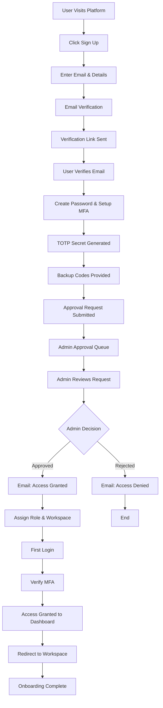

### External Client Onboarding

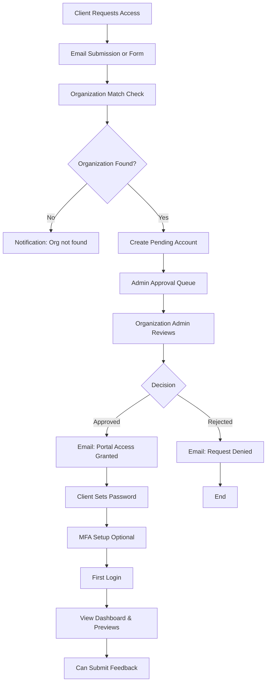

---

## 2. Workspace Access & Interaction Flow

### Designer Workspace Flow

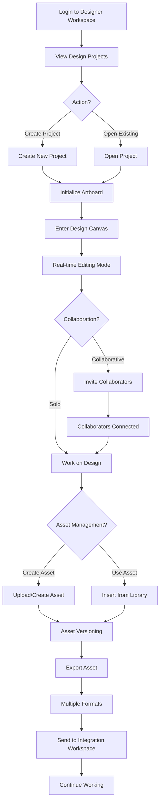

### System Analyst Workspace Flow

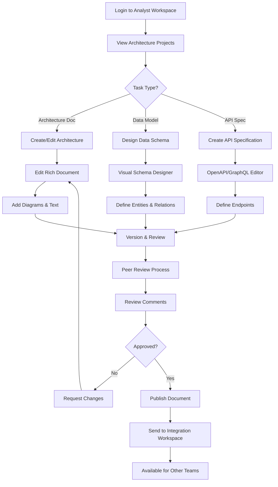

### QA Testing Workspace Flow

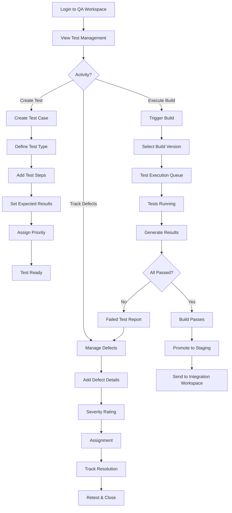

### AI Builder Workspace Flow

```mermaid
graph TD
    A["Login to AI Workspace"] --> B["View Models & Pipelines"]
    B --> C{Task Type?}
    C -->|Create Model| D["New Model"]
    C -->|Setup Pipeline| E["New Training Pipeline"]
    C -->|Deploy Model| F["Model Deployment"]
    D --> G["Define Model Type"]
    G --> H["Configure Parameters"]
    H --> I["Set Hyperparameters"]
    I --> J["Model Ready"]
    E --> K["Select Model"]
    K --> L["Configure Data Pipeline"]
    L --> M["Set Training Parameters"]
    M --> N["Create Training Job"]
    J --> O[Could connect to]: N
    N --> P["Job Queued"]
    P --> Q["Job Executing"]
    Q --> R["Monitor Metrics"]
    R --> S["Training Complete"]
    F --> T["Select Model Version"]
    T --> U["Choose Environment"]
    U --> V["Deploy to Staging"]
    V --> W["Verify Deployment"]
    W --> X{Production Ready?}
    X -->|No| Y["Back to Training"]
    X -->|Yes| Z["Deploy to Production"]
    S --> AA["Send to Integration"]
    Z --> AB["Model Live"]
```

---

## 3. Admin Approval workflow

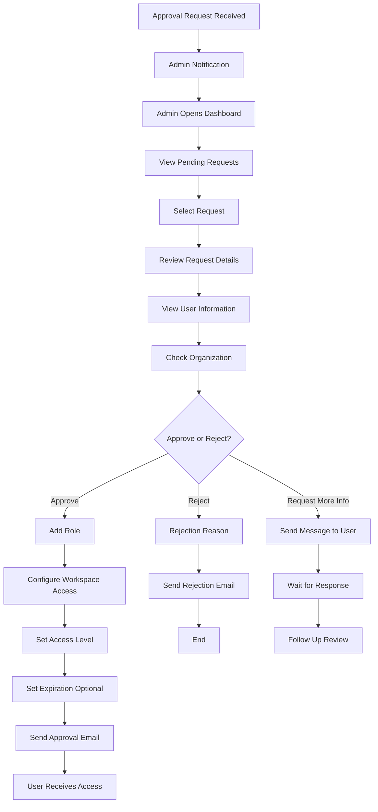

---

## 4. Client Portal Flow

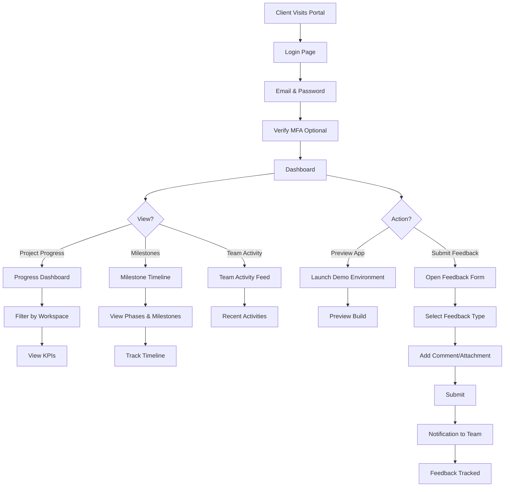

---

## 5. Integration Workspace (Central Assembly) Flow

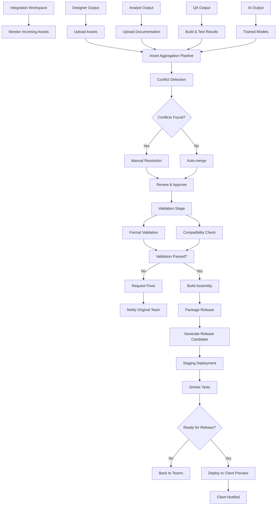

---

## 6. Real-time Collaboration Flow

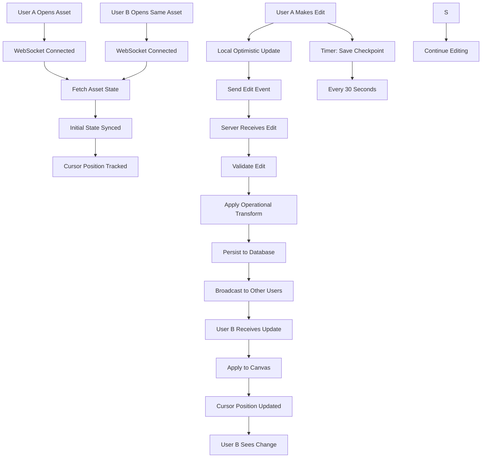

---

## 7. Build & Release Pipeline Flow

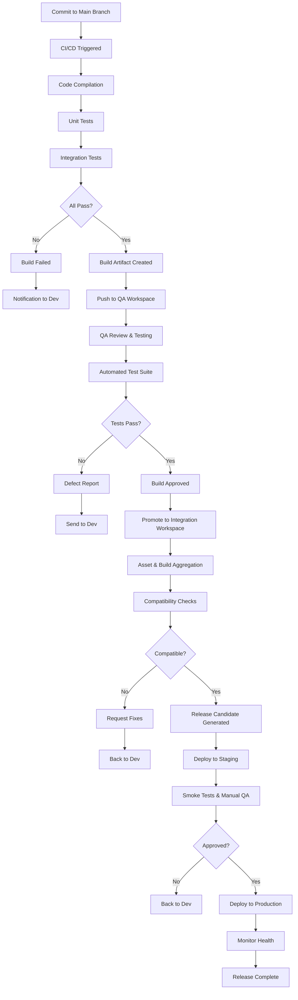

---

## 8. Data Access & Security Flow

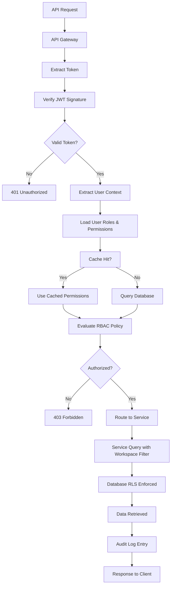

---

**Version**: 1.0  
**Last Updated**: February 25, 2026  
**Diagram Type**: User Flow & Process Flows
